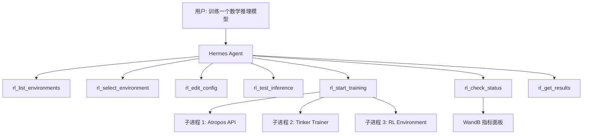
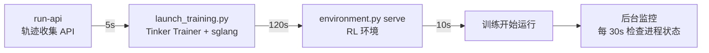

# 从 Coding Agent 到个人助理（九）：RL 训练闭环

前面的系列围绕的是一个"推理时"（inference-time）的 Agent——用现成的 LLM，通过 Prompt Engineering、Skill 系统、记忆机制来提升表现。但 Hermes Agent 还有另一条路：**直接训练一个更好的模型**。

Hermes 在 README 中将自己标记为 **Research-ready**：

> Batch trajectory generation, Atropos RL environments, trajectory compression for training the next generation of tool-calling models.

本篇拆解这套 RL 训练机制的完整实现——从数据生成、轨迹压缩到训练编排。

## 核心设计：Agent 即编排器

Hermes 自己不做模型训练。它的定位是**训练编排器**——用 Agent 的工具调用能力来管理整个训练流程：



用户只需要说"Train a model on GSM8k for math reasoning"，Agent 自己决定调用哪些工具、怎么配参数、什么时候检查状态。这跟调用 `bash` 或 `read` 没有本质区别——RL 训练只是 Agent 的另一组工具。

## 第一环：数据生成

### 数据从哪来？

一个常见的误解：训练数据是不是来自用户的历史对话？

**不是。** Hermes 日常使用时确实能保存对话轨迹（`--save_trajectories` 标志），但 RL 训练不直接使用这些历史记录。原因很实际：

- 历史对话质量参差不齐——有闲聊、有失败、有高度项目相关的内容
- 训练需要**可控变量**——固定 prompt 集、固定工具集、每个 prompt 独立沙箱
- 历史对话包含项目记忆文件（SOUL.md、AGENTS.md）和持久记忆，会污染训练数据

实际的数据来源分两层：

| 阶段 | 数据源 | 用途 |
|---|---|---|
| SFT 数据生成（batch_runner） | 人工编写的 prompt JSONL | 用强模型跑 Agent，录制工具调用轨迹 |
| RL 训练（Atropos 环境） | HuggingFace 公开 Benchmark | 模型在线做 rollout，环境打分给 reward |

不过有意思的是，历史对话和 batch_runner 输出使用**完全相同的 ShareGPT 格式**——都是 `{"conversations": [{"from": "human", "value": "..."}, ...]}` 的 JSONL。如果你把 `trajectory_samples.jsonl`（历史对话）喂给 `trajectory_compressor.py`，它完全能处理。Hermes 只是没有建立这条自动化管道。

### BatchRunner

`batch_runner.py` 是数据生成的核心——用 Agent 自己来批量生成训练数据，让 Agent 处理大量 prompt，记录完整的工具调用轨迹：

```python
# batch_runner.py

class BatchRunner:
    """
    并行批量处理：
    - 从 JSONL 数据集加载 prompt
    - 用 multiprocessing.Pool 并行处理
    - 断点续传（checkpoint）
    - 输出 ShareGPT 格式轨迹
    """
```

使用方式：

```bash
python batch_runner.py \
    --dataset_file=data.jsonl \
    --batch_size=10 \
    --run_name=my_run \
    --resume  # 断点续传
```

每个 prompt 的处理流程：

```python
def _process_single_prompt(prompt_index, prompt_data, batch_num, config):
    # 1. 初始化一个 Agent 实例
    agent = AIAgent(
        model=config["model"],
        max_iterations=config["max_iterations"],
        enabled_toolsets=selected_toolsets,
        save_trajectories=False,      # BatchRunner 自己管保存
        skip_context_files=True,      # 不注入 SOUL.md/AGENTS.md
        skip_memory=True,             # 不用持久记忆
    )

    # 2. 运行完整对话
    result = agent.run_conversation(prompt, task_id=task_id)
    
    # 3. 提取工具使用统计
    tool_stats = _extract_tool_stats(result["messages"])
    
    # 4. 转换为训练数据格式
    trajectory = agent._convert_to_trajectory_format(
        result["messages"], prompt, result["completed"]
    )
```

三个关键设计：
- **`save_trajectories=False`**：BatchRunner 自己管保存逻辑，不用 Agent 内置的轨迹保存
- **`skip_context_files=True`**：不注入项目记忆文件（SOUL.md/AGENTS.md），避免污染训练数据
- **`skip_memory=True`**：不使用持久记忆，每个 prompt 都是独立干净的样本

### ShareGPT 格式

Agent 对话被转换为 ShareGPT 格式——这是 LLM 训练数据的行业标准：

```python
# agent/trajectory.py

def save_trajectory(trajectory, model, completed, filename=None):
    """保存轨迹为 JSONL。"""
    entry = {
        "conversations": trajectory,  # [{from: "user", value: "..."}, ...]
        "timestamp": datetime.now().isoformat(),
        "model": model,
        "completed": completed,
    }
    with open(filename, "a") as f:
        f.write(json.dumps(entry, ensure_ascii=False) + "\n")
```

每条轨迹的结构：

```json
{
  "conversations": [
    {"from": "user", "value": "帮我调试这个 Python 脚本"},
    {"from": "assistant", "value": "<think>需要先读取文件...</think>\n我来看看..."},
    {"from": "tool", "value": "{\"content\": \"def main(): ...\"}", "tool_call": {...}},
    {"from": "assistant", "value": "问题在第 15 行..."}
  ],
  "completed": true,
  "tool_stats": {"read": {"count": 3, "success": 3, "failure": 0}},
  "toolsets_used": ["terminal", "file_tools"]
}
```

### 质量筛选

BatchRunner 在保存前做两层筛选：

```python
# 1. 推理覆盖率检查
reasoning = result.get("reasoning_stats", {})
if not reasoning.get("has_any_reasoning", True):
    # 没有任何推理过程的样本丢弃
    print(f"🚫 Prompt {prompt_index} discarded (no reasoning in any turn)")
    continue

# 2. 工具统计标准化（确保 HuggingFace datasets 可以加载）
tool_stats = _normalize_tool_stats(raw_tool_stats)
```

丢弃"没有推理过程"的样本——如果 Agent 在每一轮都没有产生 `<think>` 标签内的推理文本，说明这条轨迹的训练信号太弱。

## 第二环：轨迹压缩

生成的轨迹可能很长（Agent 反复调用工具），但训练时有 token 预算限制。`trajectory_compressor.py` 负责把长轨迹压缩到预算内：

### 压缩策略

```python
# trajectory_compressor.py

@dataclass
class CompressionConfig:
    target_max_tokens: int = 15250       # 目标上限
    summary_target_tokens: int = 750     # 摘要目标长度
    protect_first_system: bool = True    # 保护 system prompt
    protect_first_human: bool = True     # 保护第一个用户消息
    protect_first_gpt: bool = True       # 保护第一个 assistant 回复
    protect_first_tool: bool = True      # 保护第一个工具结果
    protect_last_n_turns: int = 4        # 保护最后 N 轮
    summarization_model: str = "google/gemini-3-flash-preview"
```

核心逻辑用一句话概括：**保护两头，压缩中间**。

```
完整轨迹：
[system] [user] [assistant] [tool] [assistant] [tool] [assistant] [tool] ... [assistant] [tool] [assistant] [tool] [assistant]
 ↑保护↑  ↑保护↑  ↑保护↑    ↑保护↑  ←───── 中间轮次：用 LLM 摘要替换 ─────→  ←── 最后 4 轮：保护 ──→

压缩后：
[system] [user] [assistant] [tool] [summary: "之前做了 X、Y、Z..."] [assistant] [tool] [assistant] [tool] [assistant]
```

为什么保护首尾？
- **首轮**：包含任务定义和初始推理方向——这是训练信号最强的部分
- **末轮**：包含最终解答和结论——这是 reward 信号对应的部分
- **中间**：反复的工具调用和探索——训练价值低，压缩掉

### 压缩指标

```python
@dataclass
class TrajectoryMetrics:
    original_tokens: int = 0       # 压缩前
    compressed_tokens: int = 0     # 压缩后
    compression_ratio: float = 1.0 # 压缩比
    turns_removed: int = 0         # 移除的轮次数
    was_compressed: bool = False
    still_over_limit: bool = False # 压缩后仍超限
```

## 第三环：RL 训练

### 训练框架：Tinker-Atropos

Hermes 集成的训练框架是 **Tinker-Atropos**（以 git submodule 形式嵌入）：

- **Atropos**：RL 环境框架，定义 prompt、评分、reward
- **Tinker**：训练后端，提供 GPU 推理 + 梯度更新
- 训练算法：**GRPO**（Group Relative Policy Optimization）
- 微调方式：**LoRA**（rank=32）

### 环境发现

`rl_training_tool.py` 用 AST 扫描找到所有可用的 RL 环境：

```python
def _scan_environments():
    """用 AST 扫描 environments 目录，找到所有 BaseEnv 子类。"""
    for py_file in ENVIRONMENTS_DIR.glob("*.py"):
        tree = ast.parse(py_file.read_text())
        
        for node in ast.walk(tree):
            if isinstance(node, ast.ClassDef):
                for base in node.bases:
                    if base_name == "BaseEnv":
                        # 提取环境名、描述、配置类
                        environments.append(EnvironmentInfo(
                            name=env_name,
                            class_name=node.name,
                            file_path=str(py_file),
                        ))
```

每个环境是一个 Python 文件，继承 `BaseEnv`，定义：
- `load_dataset()`：加载训练数据
- `get_next_item()`：构造 prompt
- `score_answer()` / `score()`：评分逻辑（这就是 reward 函数）
- `system_prompt`：指令格式

### 锁定配置 vs 可调配置

训练参数分两类：

```python
# 基础设施参数——锁定，不允许 Agent 修改
LOCKED_FIELDS = {
    "env": {
        "tokenizer_name": "Qwen/Qwen3-8B",
        "rollout_server_url": "http://localhost:8000",
        "max_num_workers": 2048,
        "total_steps": 2500,
    },
    "tinker": {
        "lora_rank": 32,
        "learning_rate": 0.00004,
    },
}

# 可调参数——Agent 可以通过 rl_edit_config 修改
# group_size, batch_size, wandb_project, wandb_name, ...
```

这个设计很聪明：让 Agent 能调"安全"的参数（batch size、WandB 项目名），但不能碰基础设施参数（学习率、LoRA rank、服务器地址）。防止 Agent 误操作导致训练失败。

### 启动训练

`rl_start_training()` 按顺序启动 3 个子进程：

```python
async def _spawn_training_run(run_state, config_path):
    """按顺序启动 3 个进程，每个等上一个就绪后再启动下一个。"""
    
    # 进程 1: Atropos API 服务器
    run_state.api_process = subprocess.Popen(
        ["run-api"],
        cwd=str(TINKER_ATROPOS_ROOT),
    )
    await asyncio.sleep(5)  # 等 API 启动
    
    # 进程 2: Tinker Trainer（推理服务器 + 训练器）
    run_state.trainer_process = subprocess.Popen(
        [sys.executable, "launch_training.py", "--config", str(config_path)],
        env={**os.environ, "TINKER_API_KEY": os.getenv("TINKER_API_KEY", "")},
        cwd=str(TINKER_ATROPOS_ROOT),
    )
    await asyncio.sleep(30)   # 等推理服务器在 :8001 上就绪
    await asyncio.sleep(90)   # 再等 90 秒确保完全初始化
    
    # 进程 3: RL 环境
    run_state.env_process = subprocess.Popen(
        [sys.executable, str(env_file), "serve", "--config", str(config_path)],
        cwd=str(TINKER_ATROPOS_ROOT),
    )
    await asyncio.sleep(10)
    
    run_state.status = "running"
    
    # 启动后台监控
    asyncio.create_task(_monitor_training_run(run_state))
```

启动顺序有严格依赖关系：



等待时间不是随意设的——Trainer 需要 120 秒来启动 sglang 推理服务器和加载模型权重，环境启动后需要连接到 API 和 Trainer。

### 后台监控

```python
async def _monitor_training_run(run_state):
    """每 30 秒检查一次进程状态。"""
    while run_state.status == "running":
        await asyncio.sleep(30)
        
        # 任何一个进程退出 → 检查退出码
        if run_state.env_process.poll() is not None:
            exit_code = run_state.env_process.returncode
            if exit_code == 0:
                run_state.status = "completed"
            else:
                run_state.status = "failed"
            _stop_training_run(run_state)
            break
```

三个进程中任何一个异常退出，都会触发整体停止（`_stop_training_run` 按逆序终止：environment → trainer → API）。

## 第四环：监控与评估

### WandB 集成

`rl_check_status()` 通过 WandB API 查询训练指标：

```python
async def rl_check_status(run_id):
    """带速率限制的状态查询。"""
    # 强制 30 分钟间隔
    elapsed = now - _last_status_check[run_id]
    if elapsed < 30 * 60:
        return {"rate_limited": True, "next_check_in_seconds": remaining}
    
    # 查询 WandB
    api = wandb.Api()
    runs = api.runs(
        f"{os.getenv('WANDB_ENTITY', 'nousresearch')}/{wandb_project}",
        filters={"display_name": run_state.wandb_run_name}
    )
    
    return {
        "metrics": {
            "step": wandb_run.summary.get("_step", 0),
            "reward_mean": wandb_run.summary.get("train/reward_mean"),
            "percent_correct": wandb_run.summary.get("train/percent_correct"),
            "eval_percent_correct": wandb_run.summary.get("eval/percent_correct"),
        }
    }
```

**30 分钟限频**是关键设计——训练一次跑几个小时，频繁查询既没有意义，又容易让 Agent 进入"查状态 → 没变化 → 再查"的死循环。

### 推理测试

训练前可以用 `rl_test_inference()` 做快速验证——不需要 GPU，通过 OpenRouter API 远程推理：

```python
# 3 个不同规模的模型，验证环境是否正常
TEST_MODELS = [
    {"id": "qwen/qwen3-8b", "scale": "small"},
    {"id": "z-ai/glm-4.7-flash", "scale": "medium"},
    {"id": "minimax/minimax-m2.7", "scale": "large"},
]
# 3 steps × 16 completions × 3 models = 144 rollouts
```

用不同规模的模型测试，验证 4 件事：
1. 环境能加载
2. Prompt 构造正确
3. 推理输出能被解析
4. 评分/验证逻辑正常

## RL CLI：用 Agent 驱动训练

`rl_cli.py` 是专门的训练入口——创建一个拥有 RL 工具集的 Agent：

```python
# rl_cli.py

RL_SYSTEM_PROMPT = """You are an automated post-training engineer 
specializing in reinforcement learning for language models.

## Your Capabilities

1. DISCOVER: Use rl_list_environments to see available RL environments
2. INSPECT: Read environment files to understand how they work
3. CREATE: Copy existing environments as templates, modify for your needs
4. CONFIGURE: Use rl_select_environment and rl_edit_config
5. TEST: Always use rl_test_inference before full training
6. TRAIN: Use rl_start_training to begin, rl_check_status to monitor
7. EVALUATE: Use rl_get_results and analyze WandB metrics
"""

agent = AIAgent(
    model="anthropic/claude-opus-4.5",  # 用旗舰模型做编排决策
    max_iterations=200,                  # 训练流程长，允许更多迭代
    enabled_toolsets=["terminal", "web", "rl"],
    ephemeral_system_prompt=RL_SYSTEM_PROMPT,
)
```

使用方式：

```bash
# 单次任务
python rl_cli.py "Train a model on GSM8k for math reasoning"

# 交互模式
python rl_cli.py --interactive

# 查看可用环境
python rl_cli.py --list-environments
```

注意 `max_iterations=200`——普通对话用 20 就够了，但 RL 训练工作流可能涉及：列环境 → 读代码 → 改配置 → 测试 → 启动 → 等 30 分钟 → 查状态 → 调参 → 重新训练...200 轮迭代给了 Agent 足够的操作空间。

## 完整数据流

```
数据集（JSONL）
  ↓
batch_runner.py ← 用旗舰模型运行 Agent，生成工具调用轨迹
  ├→ multiprocessing.Pool 并行处理
  ├→ 每个 prompt → AIAgent.run_conversation()
  ├→ 提取 tool_stats + reasoning_stats
  ├→ 转换为 ShareGPT 格式
  └→ 筛选：丢弃无推理过程的样本
  ↓
trajectory_compressor.py ← 压缩长轨迹到 token 预算内
  ├→ 保护首尾轮次
  ├→ LLM 摘要替换中间轮次
  └→ 输出压缩后的 JSONL
  ↓
rl_cli.py → Agent 编排训练
  ├→ rl_list_environments()  → AST 扫描发现 BaseEnv 子类
  ├→ rl_select_environment() → 加载环境配置
  ├→ rl_edit_config()        → 调整 batch_size 等参数
  ├→ rl_test_inference()     → OpenRouter 快速验证
  ├→ rl_start_training()     → 启动 3 个子进程
  │    ├→ run-api（Atropos 轨迹 API）
  │    ├→ launch_training.py（Tinker Trainer + sglang）
  │    └→ environment.py serve（RL 环境）
  ├→ rl_check_status()       → WandB 指标（30 分钟限频）
  └→ rl_get_results()        → 最终模型和指标
  ↓
训练产物
  ├→ LoRA 权重（Qwen3-8B + LoRA rank=32）
  └→ WandB 面板（reward_mean, percent_correct, eval_percent_correct）
```

## 不是传统意义上的"模型训练"

理解 Hermes 的 RL 机制，有几个常见误解需要澄清：

### 没有 Reward Model

传统 RLHF 需要单独训练一个 Reward Model 来打分。Hermes 不用——奖励来自 Atropos 环境的 **规则验证器**：

```python
# 环境定义 score_answer()，基于规则判断对错
# 例如数学题：答案等于标准答案 → reward = 1，否则 → reward = 0
```

这是 GRPO 的特点——不需要 Reward Model，用 group 内的相对表现作为训练信号。

### 不在本地训练

实际的梯度更新发生在 **Tinker 云服务**上：
- 需要 `TINKER_API_KEY`（Nous Research 提供）
- sglang 推理服务器需要 GPU
- Hermes 只是编排层

### 不是端到端自动化

博客文章常把 Hermes 描述为“全自动训练框架”，实际上：
- 数据集需要**手动准备**（`--dataset_file=data.jsonl`）
- 环境需要**手动选择或创建**
- 参数调优依赖 Agent 的判断（通过旗舰模型）

Hermes 做的是把这些手动步骤**封装为 Agent 工具**，让 LLM 来执行操作流程——降低了使用门槛，但不是魔法。

### 不是基于历史对话训练

Hermes 的 Skill 自进化确实基于历史对话——但 RL 训练不是。日常使用中 Agent 可以通过 `--save_trajectories` 保存对话到 `trajectory_samples.jsonl`，但这个文件和 RL 训练管道之间**没有自动化连接**。训练数据的实际来源：

```python
# 日常使用（默认关闭轨迹保存）
agent = AIAgent(save_trajectories=False)  # ← 默认值

# batch_runner（专门的数据生成流程）
agent = AIAgent(
    save_trajectories=False,   # BatchRunner 自己管保存
    skip_context_files=True,   # 不注入项目记忆文件
    skip_memory=True,          # 不用持久记忆
)
```

两套轨迹格式完全相同（ShareGPT JSONL），技术上可以互换，但 Hermes 有意让训练数据与日常对话保持独立——确保每条样本干净、可控、不受项目上下文污染。

## 设计回顾

Hermes 的 RL 训练机制体现了一个核心思想：**用 Agent 能力来增强 Agent 训练**。

传统的 RL for LLM 流程需要 ML 工程师手动操作每一步：准备数据、写环境代码、配置训练、监控指标。Hermes 的做法是把这些操作都暴露为 Tool Schema，让一个高能力的 Agent（Claude Opus 通过 OpenRouter）来编排。

这比"自动训练"更准确的描述是**"Agent-assisted training"**——Agent 不是自己训练自己，而是一个高能力 Agent 帮助训练一个特定领域的小模型。

```
旗舰模型（Claude Opus / GPT-4）
    │
    │ 编排决策
    ↓
Hermes Agent + RL 工具集
    │
    │ 工具调用
    ↓
Tinker-Atropos 训练后端
    │
    │ GRPO + LoRA
    ↓
领域特化模型（Qwen3-8B + LoRA）
```

这个分层设计的好处是：训练的复杂性被封装在工具背后，用户只需要用自然语言描述训练目标，Agent 处理剩下的一切。
